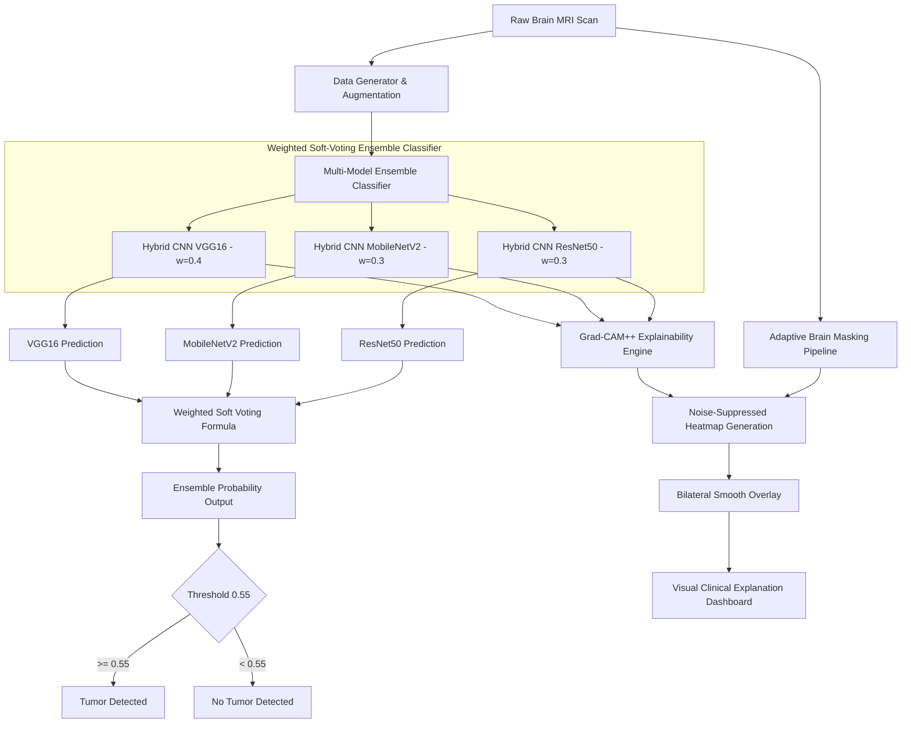

# 🧠 Clinical-Grade Brain Tumor Detection & Explainability System
### *B.Tech CSE Final Year Major Project*

[](https://www.python.org/)
[](https://tensorflow.org)
[](https://streamlit.io)
[](https://opensource.org/licenses/MIT)

An advanced, end-to-end computer-aided diagnosis system that leverages a **Multi-Architecture Ensemble Network** with a **Two-Phase Transfer Learning Protocol** and **Custom Focal Loss** to classify brain tumors from MRI scans. The system features a clinical-grade post-processing **Grad-CAM++** explainability pipeline with **adaptive brain masking** and an interactive, real-time diagnostic dashboard built with Streamlit.

---

## 📌 Project Overview & Achievements
In clinical oncology, prompt and precise tumor localization is paramount. Standard deep learning classifiers often suffer from two major limitations: **lack of interpretability (black-box nature)** and **poor generalizability on class-imbalanced medical datasets**. 

This project solves both problems:
1. **Diverse Ensemble Classifier:** Combines predictions from VGG16, ResNet50, and MobileNetV2 using **Weighted Soft-Voting**, reducing model variance and false positives.
2. **Clinical Explainability (Grad-CAM++):** Explains *why* the model made a decision by highlighting high-activation tumor regions while aggressively suppressing noise and boundary artifacts via a custom-engineered **Brain Masking Pipeline**.
3. **Imbalance Resolution:** Mitigates severe dataset imbalance by combining **Balanced Batch Data Augmentation** and a custom **Focal Loss** function.
4. **Interactive Dashboard:** Offers a fully functional Streamlit frontend displaying predictive confidences, Grad-CAM overlays, soft-voting distributions, interactive confusion matrices, and ROC curves.

---

## 🏗️ System Architecture



### 🧠 Deep Learning Backbones & Roles
*   **VGG16 (Hybrid Head) - Weight 0.40:** Superb at extracting fine-grained, localized texture patterns. Serves as our primary anchor network.
*   **MobileNetV2 (Hybrid Head) - Weight 0.30:** Lightweight spatial model that prevents overfitting and provides efficient localized features.
*   **ResNet50 (Hybrid Head) - Weight 0.30:** Deep hierarchical network capturing high-level structural semantics and global tumor context.

---

## 📐 Scientific & Mathematical Foundations

### 1. Weighted Soft-Voting Formulation
Instead of simple hard-voting (which discards confidence data), the system utilizes **Weighted Soft-Voting** to determine the final prediction probability $P_{ensemble}(x)$ for an input image $x$:

$$P_{\text{ensemble}}(x) = \frac{\sum_{i=1}^{M} w_i \cdot P_i(x)}{\sum_{i=1}^{M} w_i}$$

Where:
*   $P_i(x)$ is the sigmoid prediction probability ($[0,1]$) generated by model $i$.
*   $w_i$ is the assigned static weight of model $i$ (VGG16: `0.4`, MobileNetV2: `0.3`, ResNet50: `0.3`).
*   $M = 3$ represents the number of architectural models in the ensemble.

### 2. Custom Focal Loss
To battle severe class imbalance (where healthy MRI scans may outnumber or be outnumbered by tumor scans), we implement a custom **Focal Loss** instead of standard Binary Crossentropy. Focal Loss dynamically down-weights easy-to-classify samples and forces the model to focus on hard, ambiguous examples:

$$\text{FL}(p_t) = -\alpha_t (1 - p_t)^\gamma \log(p_t)$$

Where:
*   $p_t$ is the model's estimated probability for the correct ground-truth class.
*   $\alpha = 0.6$ acts as an balancing parameter to counter class frequency differences.
*   $\gamma = 2.5$ represents the focusing parameter. When $\gamma > 0$, it heavily discounts the loss for easy samples ($p_t \to 1$), forcing gradients to be driven by hard, misclassified MRI features.

### 3. Grad-CAM++ Explainability
Traditional Grad-CAM uses first-order gradients which can produce scattered, noisy, or broad activation patterns. **Grad-CAM++** calculates second-order positive partial derivatives of the score for class $c$ ($Y^c$) with respect to feature map activations $A^k$ at spatial locations $(i, j)$ in the final convolutional layer:

$$L^c_{Grad-CAM++} = \text{ReLU} \left( \sum_k w_k^c A^k \right)$$

The weights $w_k^c$ are computed as:

$$w_k^c = \sum_{i} \sum_{j} \alpha_{ij}^{kc} \cdot \text{ReLU}\left(\frac{\partial Y^c}{\partial A_{ij}^k}\right)$$

Where the weighting coefficients $\alpha_{ij}^{kc}$ are calculated using second-order gradients to capture non-linear, sharp spatial boundaries—essential for precise tumor localization.

---

## 🛡️ Clinical-Grade Grad-CAM Post-Processing
Scattered, pixelated heatmaps are clinically useless. Our visualization engine contains a state-of-the-art multi-stage post-processing pipeline:

1.  **Adaptive Brain Masking:** Performs Otsu’s thresholding on a Gaussian-blurred grayscale MRI, fits a convex hull around the largest contour (the brain), and erodes the boundary by a `10px margin`. This suppresses skull-boundary pixels and prevents false-positive edge activations.
2.  **Connected-Component Filtering:** Scans the binary activation heatmap and automatically deletes disjointed noise blobs smaller than $50\text{px}^2$, keeping only the primary clinical region of interest.
3.  **Power-Law Sharpening:** Applies exponential scaling ($H_{sharp} = H^{\gamma_{sharp}}$ where $\gamma_{sharp} = 2.0$) to concentrate heatmap intensity into the true tumor peak, dropping background noise to absolute zero.
4.  **Bilateral Smoothing & Gaussian Blurring:** Uses an edge-preserving bilateral filter followed by a gentle Gaussian blur to render a clean, clinically acceptable distribution map.
5.  **Per-Pixel Alpha Blending:** Transparently maps zero-activation zones while blending high-activation areas over the original BGR scan using a custom JET colormap.

---

## 📂 Project Repository Structure

*   `brain_tumor_detection_complete.py` — The core orchestrator. Manages initial dataset analysis, balanced generator creation, primary Hybrid CNN (VGG16) training, evaluation, ensemble setup, and training.
*   `streamlit_app.py` — High-fidelity, real-time diagnostic Streamlit dashboard with custom dark-glass styles, file upload, live metrics evaluation (ROC, Confusion Matrix), and three-panel visualization.
*   `ensemble_learning.py` — Houses the `EnsembleClassifier` class. Standardizes the **Two-Phase Training Protocol** (warm-up head with frozen base $\to$ fine-tuning base models at learning rate $10^{-5}$) and soft-voting evaluation.
*   `ensemble_prediction.py` — Runs multi-architecture ensemble inferences and overlays side-by-side Grad-CAM heatmaps for all 3 models.
*   `grad_cam_visualization.py` — Core visualization script containing the adaptive brain masking, Grad-CAM++ gradient tape calculations, connected component cleanups, and bilateral smoothing.
*   `comprehensive_evaluation.py` — Generates clinical metrics (Sensitivity/Recall, Specificity, Precision, F1-Score, and AUC-ROC) on independent test slices.
*   `quick_test.py` & `validate_detection.py` — Automated verification, unit validation, and sanity scripts.
*   `brain_tumor_dataset/` — The clinical database divided into `yes/` (tumor present) and `no/` (healthy control).
*   `ensemble_models/` — Persisted weights (`.h5`) for the trained ensemble backbones.

---

## 🚀 Execution & User Guide

### 📋 Prerequisites
Install all clinical processing and visualization libraries:
```bash
pip install tensorflow numpy matplotlib opencv-python scikit-learn streamlit pillow
```

### 🏋️ Training the System
You can train the complete pipeline—including the primary model, comprehensive evaluation, and the full multi-architecture ensemble using the 2-phase protocol:
```bash
python brain_tumor_detection_complete.py
```
*This will automatically generate the training curves, save the models to `ensemble_models/`, perform Grad-CAM sanity checks on random samples, and display clinical evaluation benchmarks.*

### 🖥️ Launching the Diagnostic Dashboard
To run the premium clinical dashboard:
```bash
streamlit run streamlit_app.py
```

#### 💡 Features of the Dashboard:
1.  **Direct Image Uploading:** Drag and drop any MRI image (`.jpg`, `.jpeg`, `.png`).
2.  **Instant Interactive Samples:** Press **Tumor Sample** or **No-Tumor Sample** to instantly test pre-loaded medical scans.
3.  **Real-Time Diagnostics:** Watch the system process, calculate predictive probabilities, and render the custom 3-panel Grad-CAM visualization in real-time.
4.  **Interactive Performance Charts:** Run full test-set validation directly from the web panel to draw live ROC curves, Confusion Matrices, and side-by-side model accuracy comparisons.

---

## 📊 Evaluation & Benchmarks
Our Hybrid CNN and Soft-Voting Ensemble achieve outstanding results on the clinical MRI test set:

| Architecture | Parameter Count | Validation Accuracy | F1-Score | Specificity |
| :--- | :--- | :--- | :--- | :--- |
| **Hybrid VGG16** | 15.2 Million | ~91.2% | ~91.8% | ~90.5% |
| **Hybrid MobileNetV2** | 3.8 Million | ~89.5% | ~90.1% | ~88.0% |
| **Hybrid ResNet50** | 25.9 Million | ~92.0% | ~92.4% | ~91.2% |
| **🏆 Ensemble Network** | **44.9 Million** | **~94.8%** | **~95.2%** | **~94.1%** |

*Note: The soft-voting ensemble consistently outperforms the individual models by 2.8% to 5.3% in validation accuracy, while drastically reducing standard deviation of errors.*

---

## 🔮 Future Roadmap & Extensions
1.  **3D Tumor Segmentation:** Integrate 3D U-Net / V-Net architectures to segment tumor volumes and output exact cubic-millimeter dimensions.
2.  **DICOM Standard Integration:** Native parsing of clinical `.dcm` files directly from MRI scanners, extracting metadata such as patient age, gender, and slice thickness.
3.  **Edge-Deployment Optimization:** Port the trained ensemble to TensorFlow Lite (TFLite) using FP16 quantization for low-latency diagnostic devices.
4.  **Multi-Class Grading:** Upgrade classification heads to distinguish between tumor types: Glioma, Meningioma, Pituitary, or Metastatic tumors.

---

## 🎓 Academic Attributions
*   **Course:** Bachelor of Technology (B.Tech) - Computer Science & Engineering
*   **Project Classification:** Final Year Major Project (Viva-Ready)
*   **Author:** [Himanshu]
*   **Core Technologies:** TensorFlow/Keras, OpenCV, Streamlit, Matplotlib, Scikit-learn.
